# AutoKaggle Simulator - Detailed Flow

This document provides a comprehensive flow diagram and step-by-step breakdown of how the AutoKaggle Simulator operates, including the new kaggle_crawler integration.

## High-Level Flow Diagram

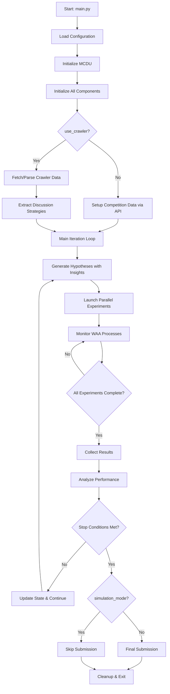

## Detailed Component Flow

### Phase 1: System Initialization

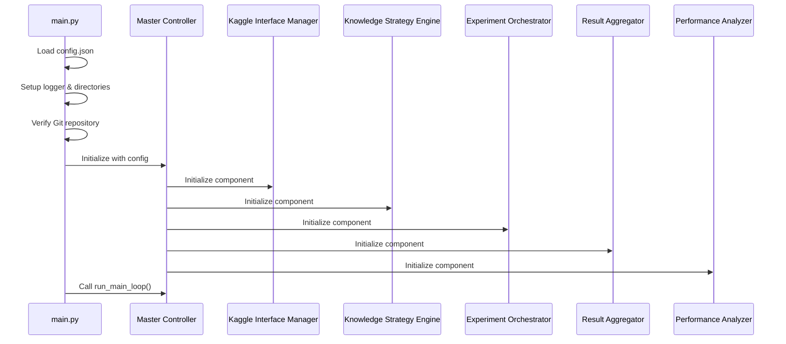

### Phase 2: Competition Setup with Crawler Integration

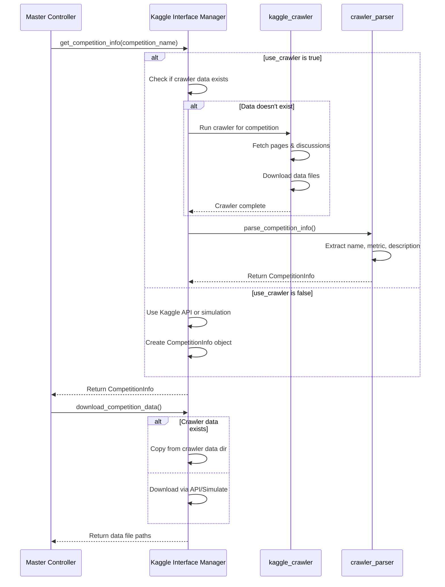

### Phase 3: Iterative Experiment Loop

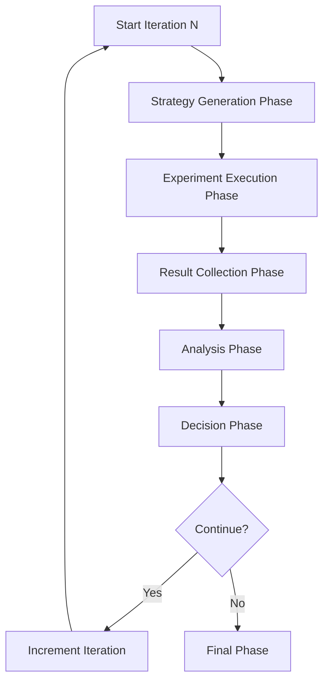

#### Strategy Generation Phase with Discussion Insights

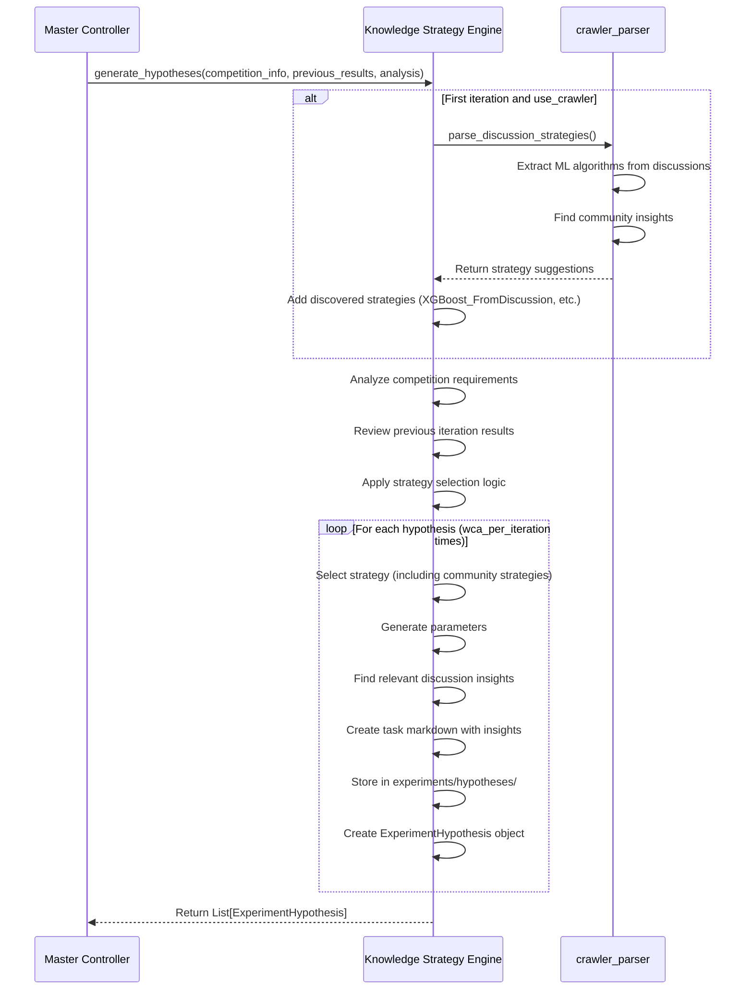

#### Experiment Execution Phase

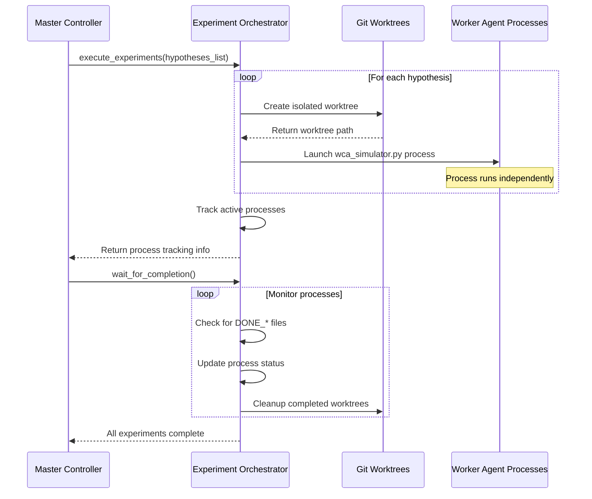

#### Worker Agent Simulation Detail

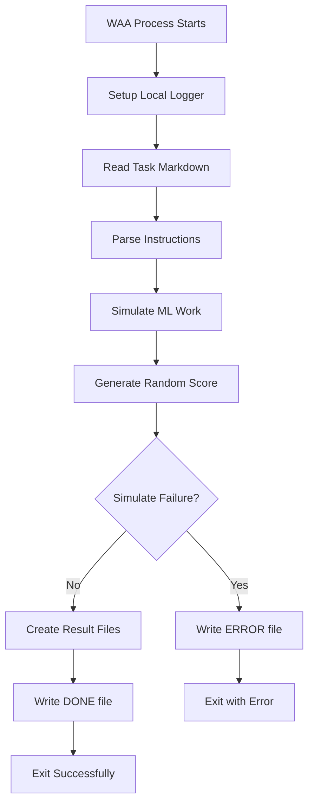

#### Result Collection Phase

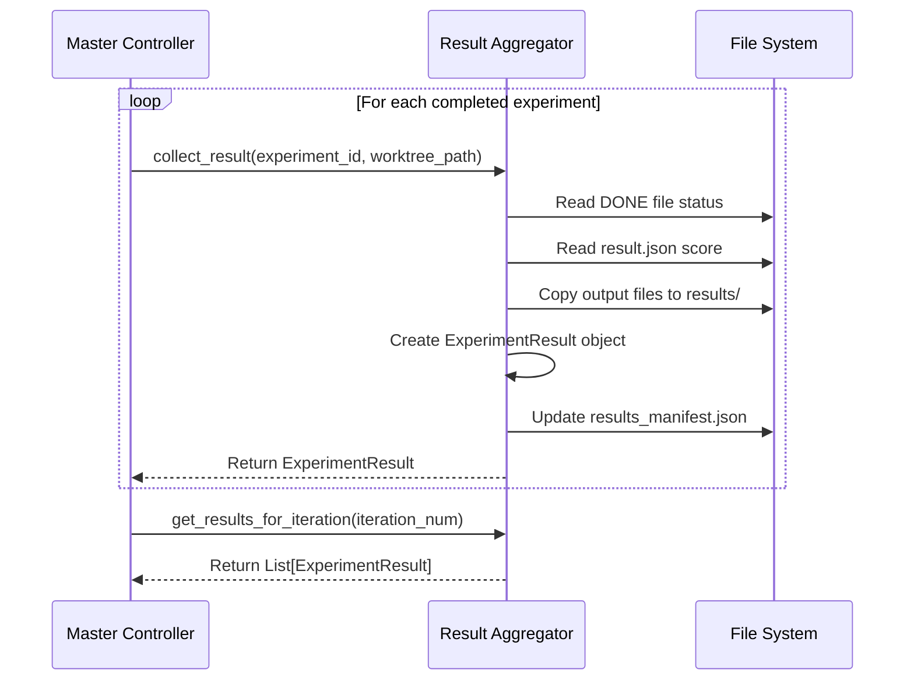

#### Analysis Phase

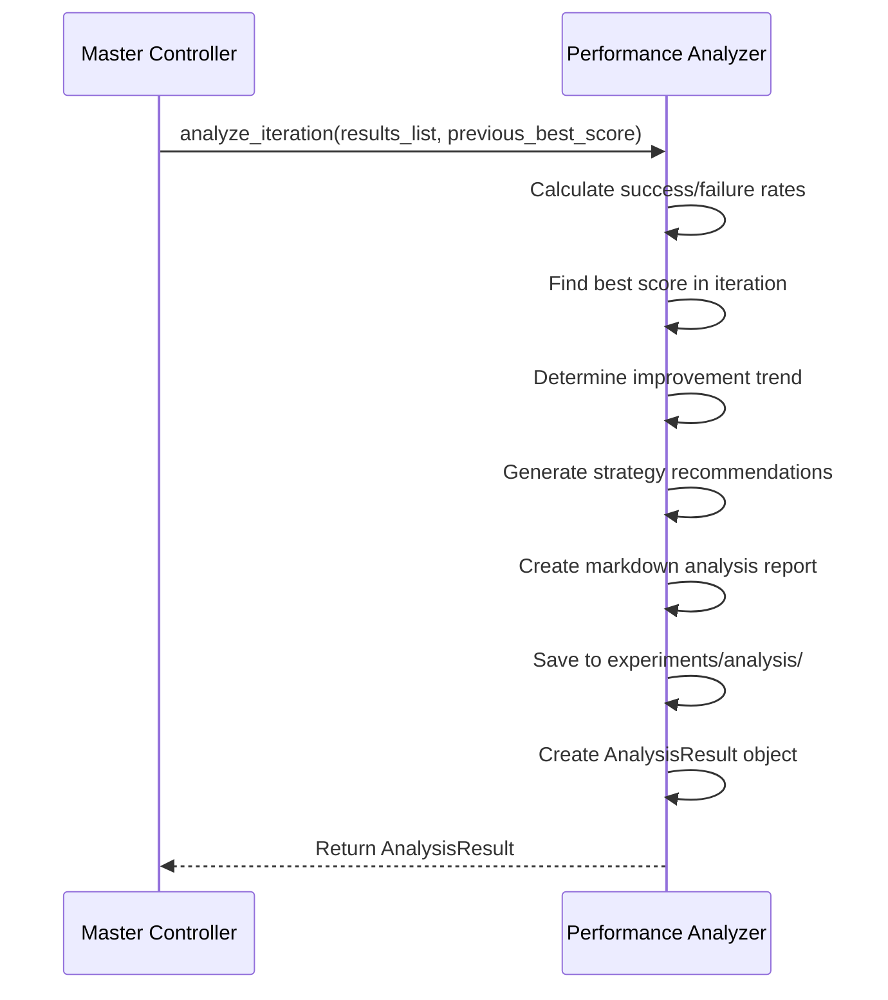

#### Decision Phase

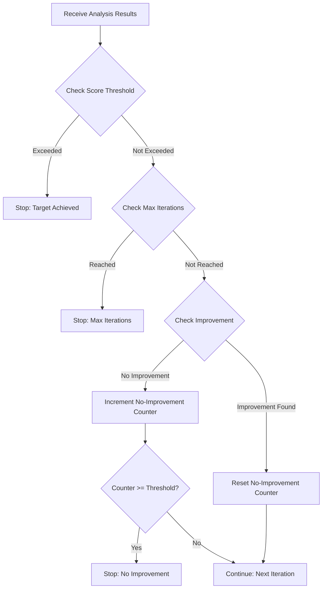

## Crawler Integration Flow

### Crawler Execution Detail

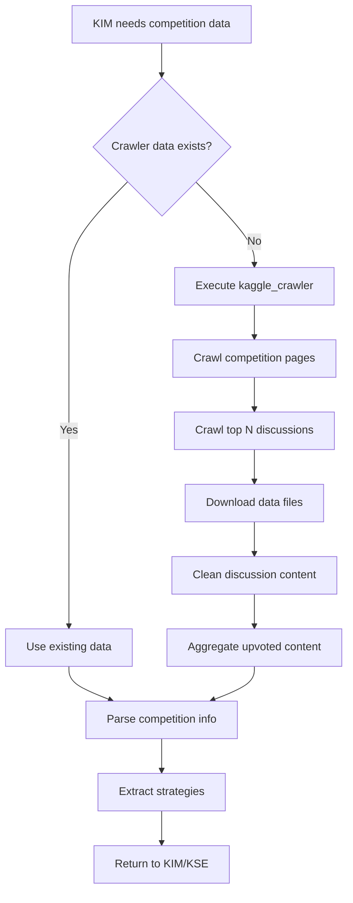

### Crawler Output Structure
```
kaggle_competitions/{competition_id}/
├── data/                    # Downloaded competition data
│   ├── train.csv
│   ├── test.csv
│   └── sample_submission.csv
├── pages/                   # Competition page content
│   ├── {competition_id}_overview.md
│   ├── {competition_id}_rules.md
│   └── {competition_id}_leaderboard.md
└── discussions/             # Discussion threads
    └── top_N_most_voted/
        ├── discussion_*.md  # Individual cleaned discussions
        └── upvoted_discussions.md  # Aggregated insights
```

## File System Flow

### Directory Creation Timeline

```
Startup:
├── logs/ (created)
├── experiments/ (created)
    ├── worktrees/ (created)
    ├── results/ (created)
    ├── hypotheses/ (created)
    ├── analysis/ (created)
    └── kaggle_data/ (created)

During Execution:
experiments/
├── worktrees/
│   ├── exp_001/ (created per experiment)
│   ├── exp_002/ (created per experiment)
│   └── exp_003/ (created per experiment)
├── results/
│   ├── results_manifest.json (updated continuously)
│   ├── exp_001/ (created after completion)
│   ├── exp_002/ (created after completion)
│   └── exp_003/ (created after completion)
├── hypotheses/
│   ├── task_001.md (created per hypothesis)
│   ├── task_002.md (created per hypothesis)
│   └── task_003.md (created per hypothesis)
├── analysis/
│   ├── analysis_iter_1.md (created per iteration)
│   ├── analysis_iter_2.md (created per iteration)
│   └── analysis_iter_3.md (created per iteration)
└── kaggle_data/
    ├── train.csv (simulated download)
    ├── test.csv (simulated download)
    └── sample_submission.csv (simulated download)
```

## Error Handling Flow

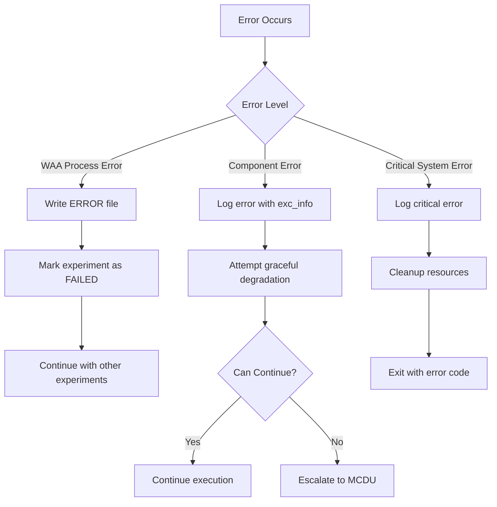

## Configuration Impact Flow

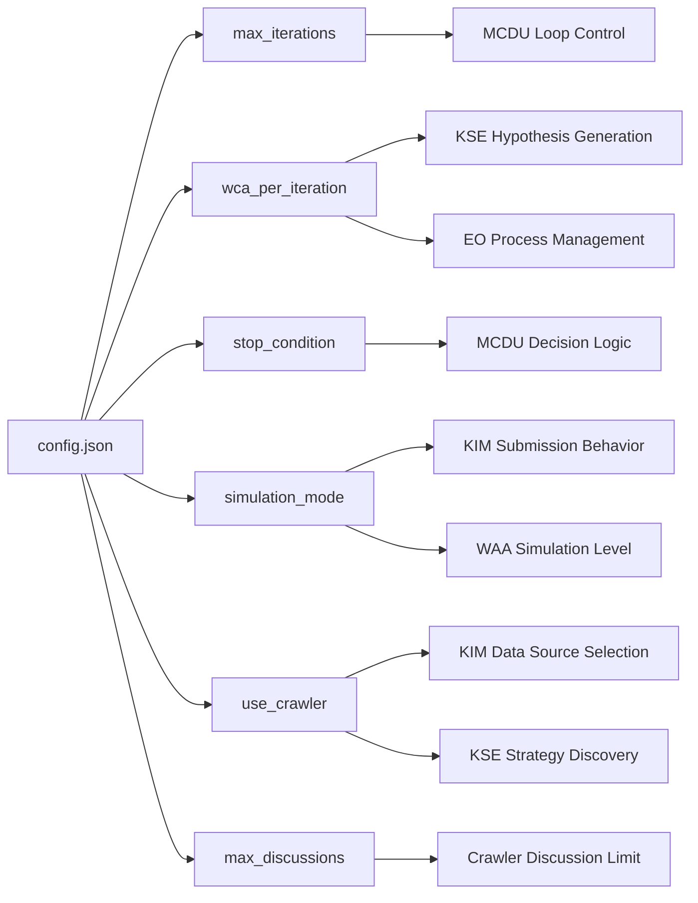

### New Configuration Options

- **use_crawler** (boolean, default: true)
  - When true: KIM uses kaggle_crawler for competition data
  - When false: KIM uses Kaggle API or simulation mode
  
- **max_discussions** (integer, default: 20)
  - Controls how many top-voted discussions to crawl
  - More discussions = more community insights but longer crawl time

- **simulation_mode** behavior with crawler:
  - true: Uses real crawler data but skips final submission (avoids SSL errors)
  - false: Full operation including Kaggle API submission

## Performance Monitoring Flow

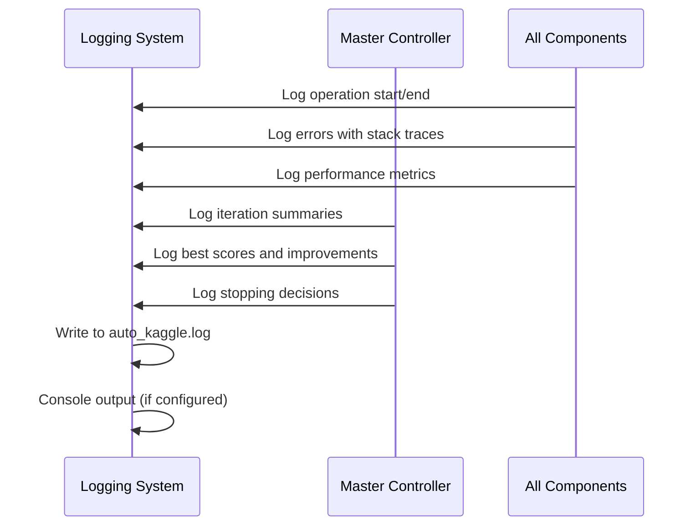

## New Components and Modules

### utils/crawler_parser.py
- **parse_competition_info()**: Extracts competition details from crawler markdown files
  - Parses competition name, evaluation metric, deadline
  - Identifies regression competitions and their metrics (RMSE, MAE)
  - Lists available data files

- **parse_discussion_strategies()**: Extracts ML strategies from community discussions
  - Finds mentioned algorithms (XGBoost, LightGBM, Neural Networks, etc.)
  - Extracts feature engineering insights
  - Returns strategies with context and upvote counts

### Enhanced KIM Features
- Automatic crawler execution if data doesn't exist
- Fallback chain: Crawler → Kaggle API → Simulation
- Reuses downloaded data from crawler to avoid redundant downloads
- Configurable through use_crawler flag

### Enhanced KSE Features
- Dynamic strategy discovery from discussions
- Adds community-validated strategies (e.g., XGBoost_FromDiscussion)
- Includes relevant discussion insights in task instructions
- Prioritizes successful community approaches

This detailed flow shows how the AutoKaggle Simulator orchestrates complex parallel ML experimentation through a sophisticated multi-agent architecture, with robust error handling, performance monitoring, adaptive decision-making capabilities, and now with real Kaggle competition data and community insights integration.
