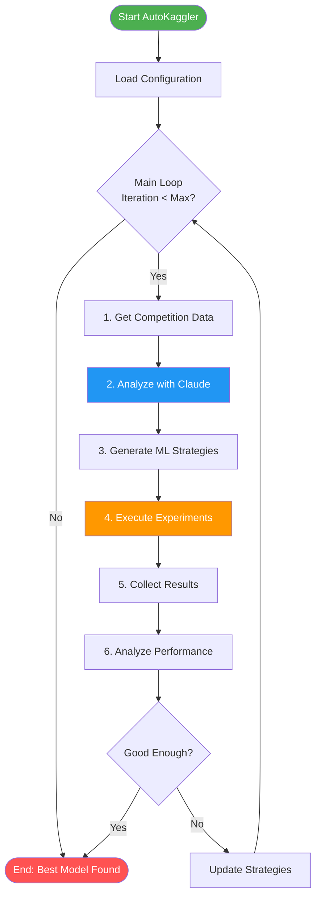
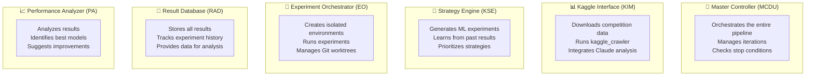
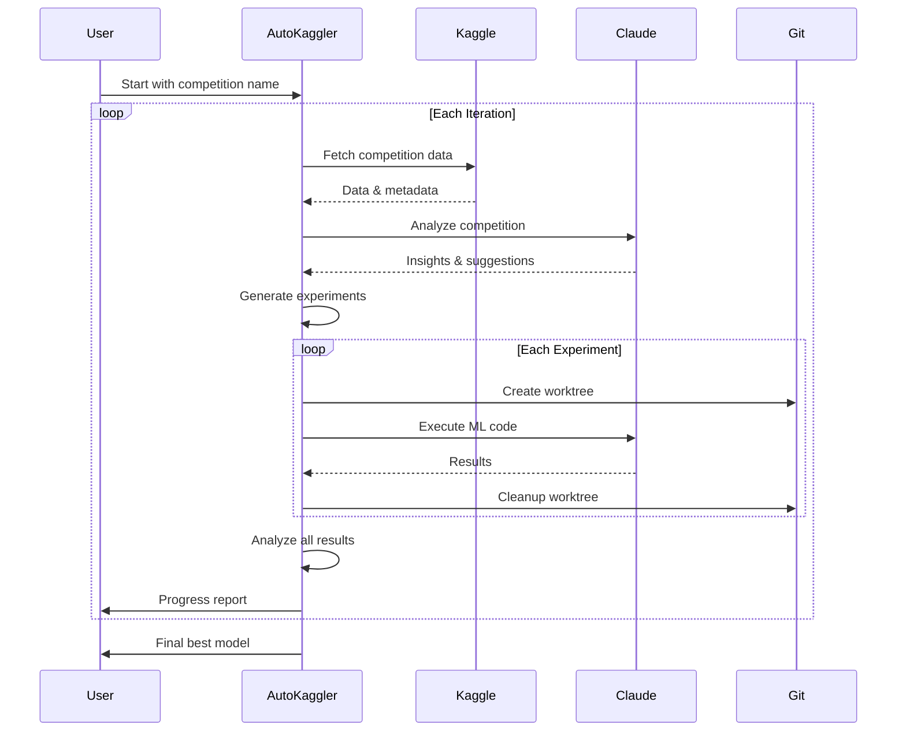
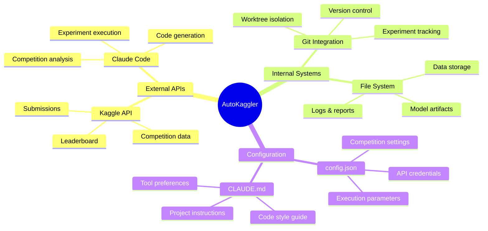

# AutoKaggler Quick Flow Overview

## High-Level System Flow

## Core Component Responsibilities

## Simplified Execution Flow

## Key Integration Points

## Data Flow Summary

```mermaid
flowchart LR
    Competition[Kaggle Competition] --> Crawler[kaggle_crawler]
    Crawler --> RawData[Raw Data<br/>Pages, Discussions]
    
    RawData --> Claude[Claude Analysis]
    Claude --> EnrichedData[Enriched Data<br/>+ Insights]
    
    EnrichedData --> Strategies[ML Strategies]
    Strategies --> Experiments[Experiments]
    
    Experiments --> Results[Results<br/>Models, Scores]
    Results --> Analysis[Performance<br/>Analysis]
    
    Analysis --> Learning[Learning<br/>Feedback]
    Learning --> Strategies
    
    style Claude fill:#2196F3,color:#fff
    style Analysis fill:#4CAF50,color:#fff
```

## Quick Start Understanding

1. **Input**: Kaggle competition name
2. **Process**: Automated ML pipeline with Claude integration
3. **Output**: Best performing model and submission

### The Loop:
1. 📥 **Fetch** - Get competition data
2. 🤖 **Analyze** - Claude understands the problem
3. 💡 **Strategize** - Generate ML approaches
4. 🧪 **Experiment** - Run isolated experiments
5. 📊 **Evaluate** - Measure performance
6. 🔄 **Iterate** - Learn and improve

### Key Features:
- **Fully Automated**: Runs without manual intervention
- **Claude-Powered**: Leverages AI for analysis and coding
- **Isolated Experiments**: Each experiment in its own Git worktree
- **Continuous Learning**: Improves strategies based on results
- **Flexible**: Supports both real execution and simulation mode