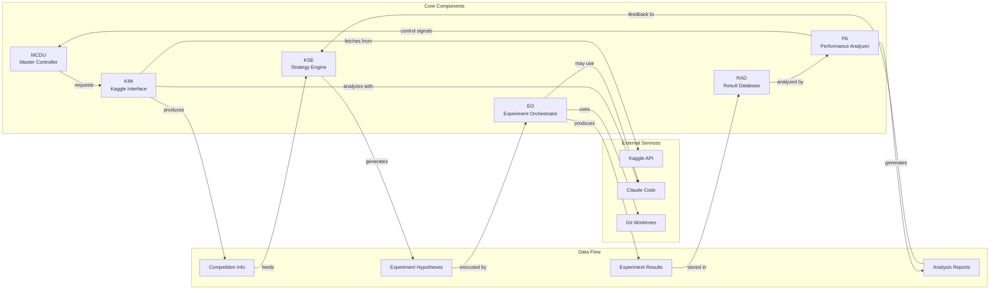
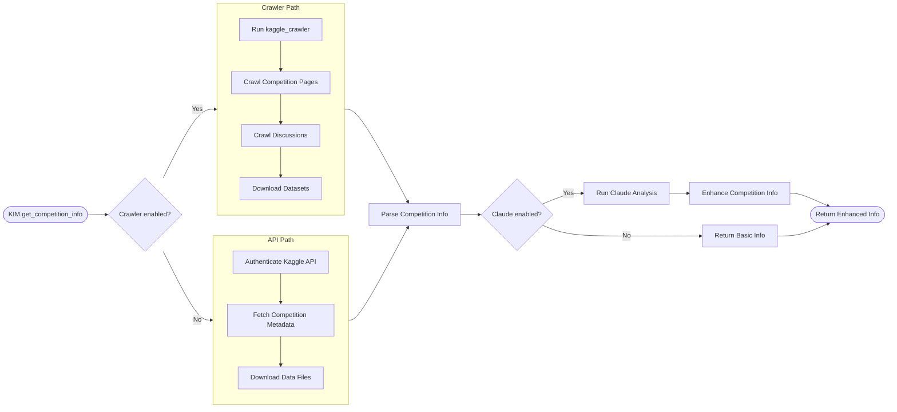
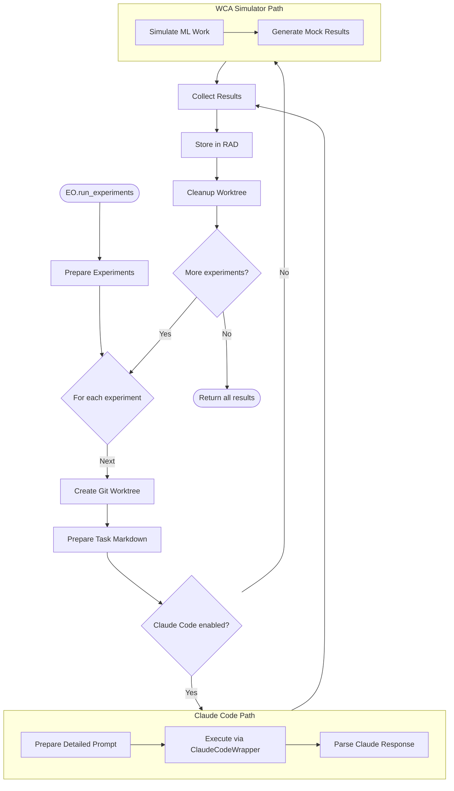
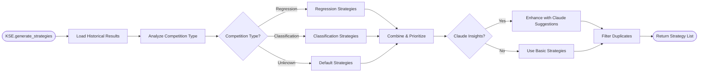
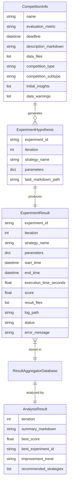
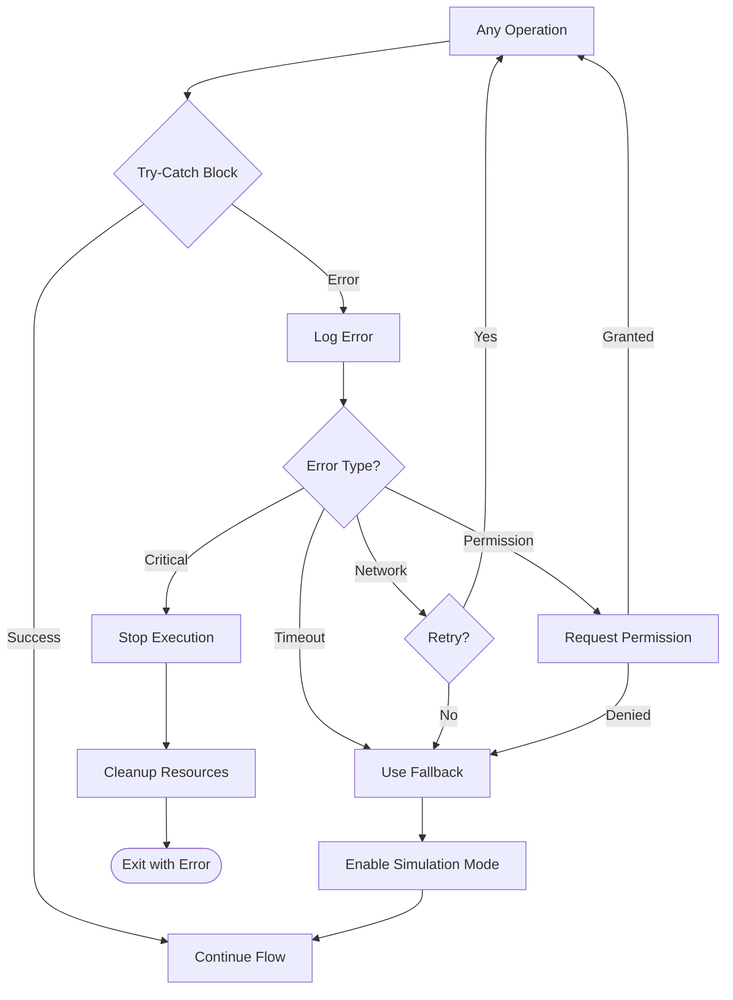
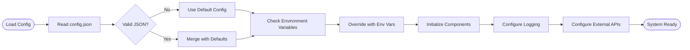

# AutoKaggler System Flow Diagram

## Overview
This document provides a visual representation of the AutoKaggler system flow using Mermaid diagrams.

## Main System Flow

```mermaid
flowchart TB
    Start([Start: main.py]) --> Init[Initialize Components]
    
    Init --> MCDU[MasterControllerDecisionUnit]
    
    MCDU --> CheckIter{Iteration < max_iterations?}
    CheckIter -->|No| End([End])
    CheckIter -->|Yes| KIM[KaggleInterfaceManager]
    
    %% Competition Data Flow
    KIM --> CrawlerCheck{Use Crawler?}
    CrawlerCheck -->|Yes| Crawler[kaggle_crawler]
    CrawlerCheck -->|No| KaggleAPI[Kaggle API]
    
    Crawler --> CompData[Competition Data]
    KaggleAPI --> CompData
    
    CompData --> ClaudeCheck{Claude Enabled?}
    ClaudeCheck -->|Yes| ClaudeAnalysis[Claude Code Analysis]
    ClaudeCheck -->|No| ParseData[Parse Competition Info]
    
    ClaudeAnalysis --> EnhancedInfo[Enhanced Competition Info]
    ParseData --> BasicInfo[Basic Competition Info]
    EnhancedInfo --> KSE[KnowledgeStrategyEngine]
    BasicInfo --> KSE
    
    %% Strategy Generation
    KSE --> GenStrat[Generate Strategies]
    GenStrat --> Strategies[List of Experiment Hypotheses]
    
    %% Experiment Execution
    Strategies --> EO[ExperimentOrchestrator]
    EO --> CreateWorktree[Create Git Worktree]
    CreateWorktree --> ExpLoop{For each experiment}
    
    ExpLoop --> WCACheck{Use Claude Code?}
    WCACheck -->|Yes| ClaudeExp[Claude Code Executor]
    WCACheck -->|No| WCA[WCASimulator]
    
    ClaudeExp --> ExpResult[Experiment Result]
    WCA --> ExpResult
    
    ExpResult --> RAD[ResultAggregatorDatabase]
    RAD --> MoreExp{More experiments?}
    MoreExp -->|Yes| ExpLoop
    MoreExp -->|No| PA[PerformanceAnalyzer]
    
    %% Analysis and Feedback
    PA --> Analysis[Generate Analysis Report]
    Analysis --> UpdateKSE[Update Strategy Knowledge]
    UpdateKSE --> CheckStop{Stop Conditions Met?}
    
    CheckStop -->|No| MCDU
    CheckStop -->|Yes| End
    
    %% Styling
    classDef component fill:#e1f5fe,stroke:#01579b,stroke-width:2px
    classDef external fill:#fff3e0,stroke:#e65100,stroke-width:2px
    classDef decision fill:#f3e5f5,stroke:#4a148c,stroke-width:2px
    classDef data fill:#e8f5e9,stroke:#1b5e20,stroke-width:2px
    
    class MCDU,KIM,KSE,EO,RAD,PA component
    class Crawler,KaggleAPI,ClaudeAnalysis,ClaudeExp,WCA external
    class CheckIter,CrawlerCheck,ClaudeCheck,WCACheck,ExpLoop,MoreExp,CheckStop decision
    class CompData,EnhancedInfo,BasicInfo,Strategies,ExpResult,Analysis data
```

## Component Interactions

## Detailed Component Flows

### 1. Competition Data Acquisition Flow

### 2. Experiment Execution Flow

### 3. Strategy Generation Flow

## Data Model Relationships

## Error Handling Flow

## Configuration Flow

## Key Features

1. **Modular Architecture**: Each component has a single responsibility
2. **External Service Integration**: Kaggle API, Claude Code, Git
3. **Fallback Mechanisms**: Simulation mode when APIs fail
4. **Iterative Improvement**: Feedback loop from analysis to strategy generation
5. **Experiment Isolation**: Git worktrees for clean experiment environments
6. **Flexible Execution**: Support for both Claude Code and simulation

## Usage

To visualize these diagrams:
1. Copy the Mermaid code blocks
2. Use [Mermaid Live Editor](https://mermaid.live/)
3. Or use any Markdown viewer that supports Mermaid (GitHub, VSCode, etc.)