# AutoKaggler ワークフロー詳細解説

## 概要

AutoKagglerは、複数のAIエージェントを並列実行してKaggleコンペティションに自律的に参加するシステムです。
本ドキュメントでは、システム全体のワークフローをMermaidグラフで可視化し、各フェーズの動作を詳しく解説します。

---

## 1. システム全体フロー

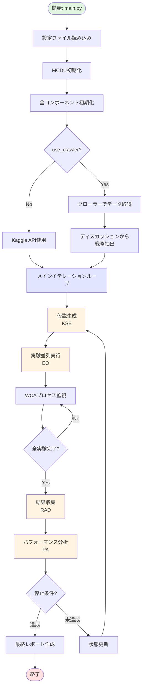

---

## 2. コンポーネント構成図

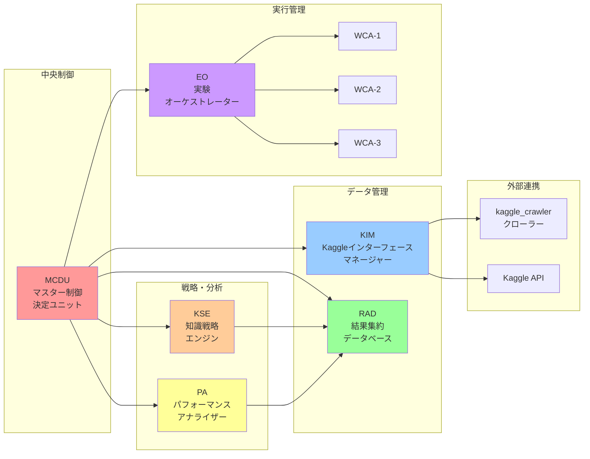

---

## 3. 初期化フェーズ詳細

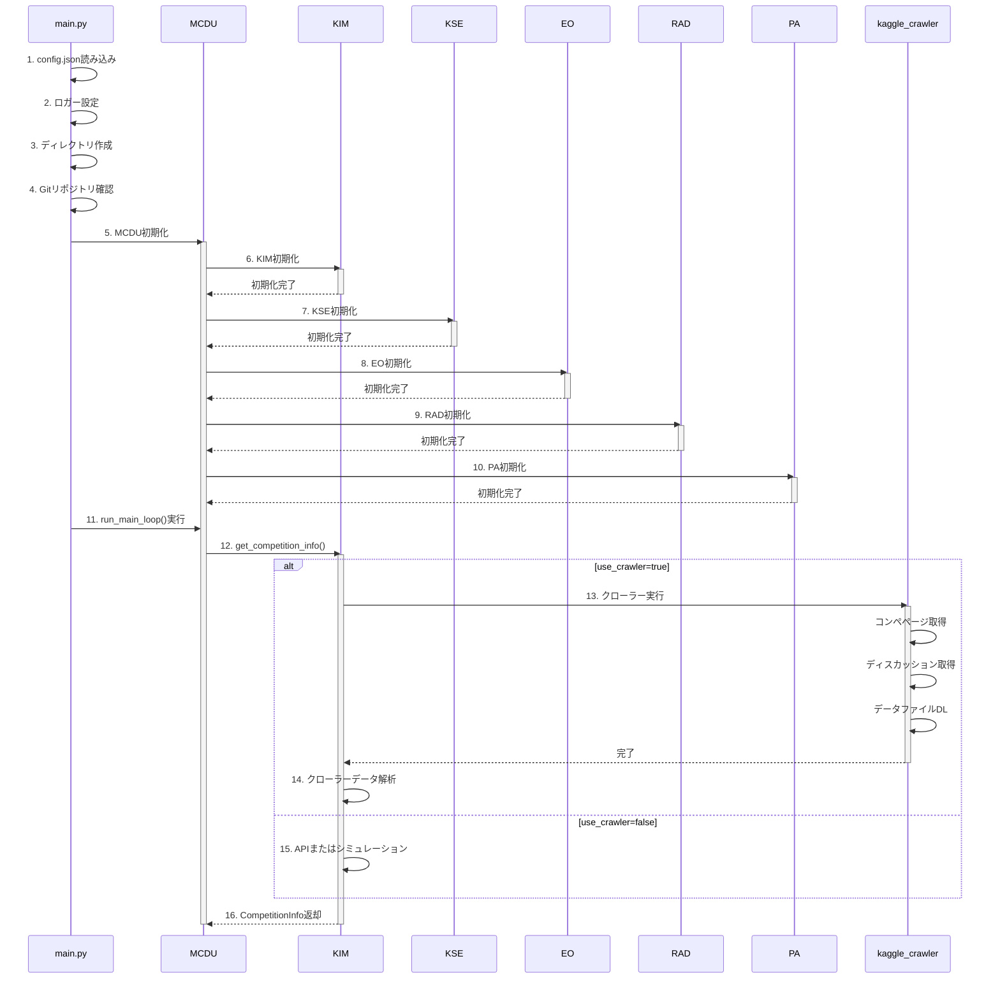

---

## 4. イテレーションループ詳細

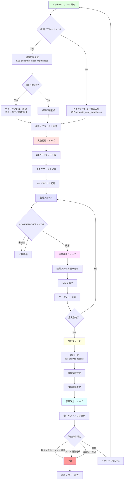

---

## 5. WCA（Worker Claude Agent）実行フロー

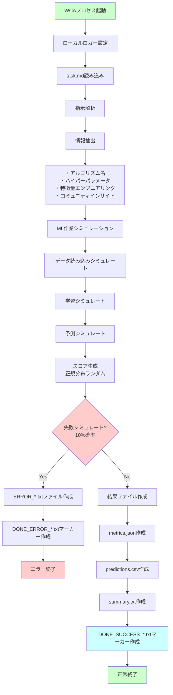

---

## 6. データフロー図

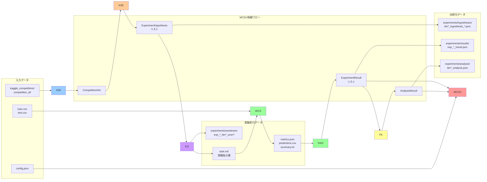

---

## 7. 停止条件判定フロー

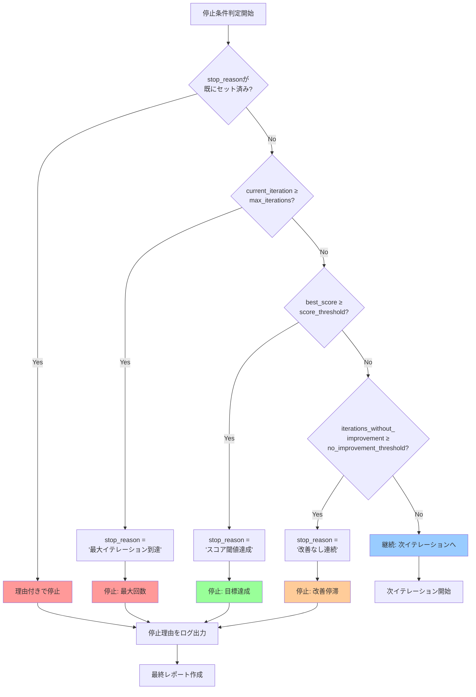

---

## 8. 仮説生成戦略選択フロー

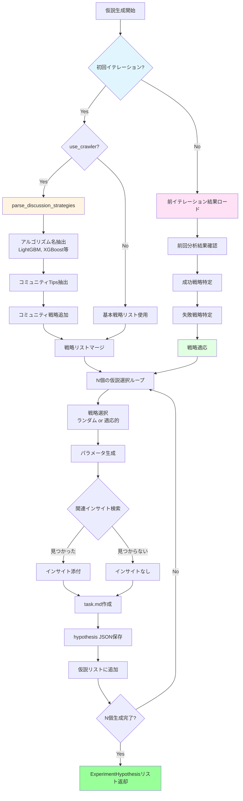

---

## 9. パフォーマンス分析フロー

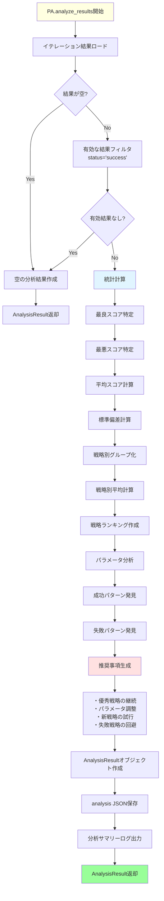

---

## 10. システム状態遷移図

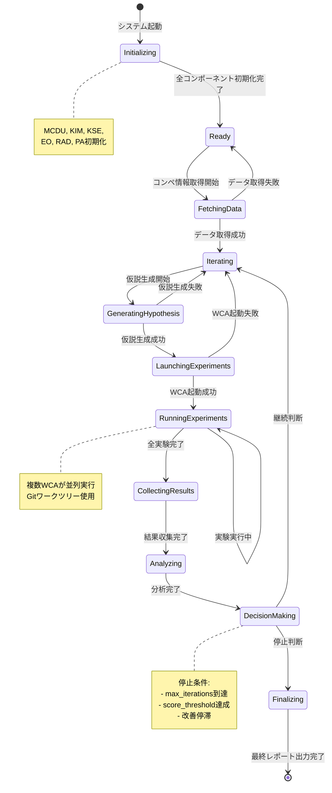

---

## 11. データモデル関係図

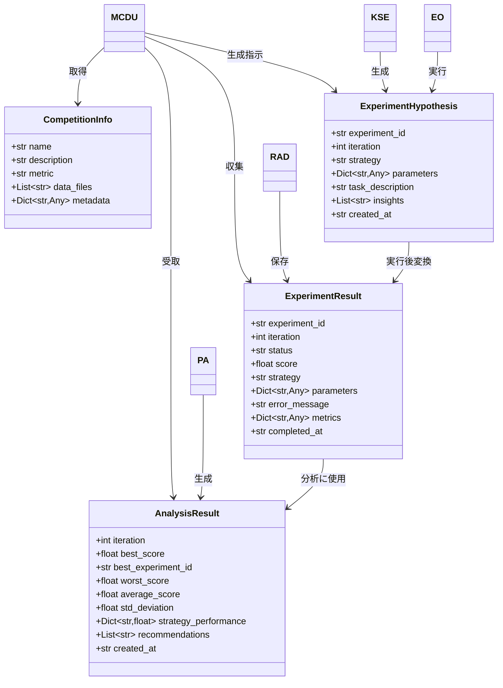

---

## 12. ファイルシステム構造とデータフロー

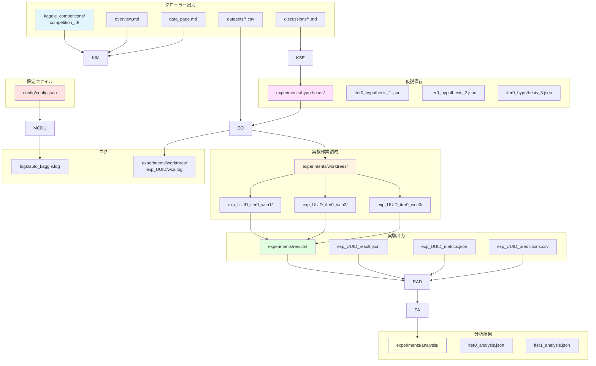

---

## まとめ

### 主要なワークフローポイント

1. **初期化**: 全コンポーネントを初期化し、Kaggleクローラーでコンペデータを取得
2. **イテレーション**: 仮説生成 → 並列実験 → 結果収集 → 分析 → 意思決定のサイクル
3. **並列実行**: Gitワークツリーを使用して複数WCAを独立した環境で同時実行
4. **学習機構**: 前イテレーションの結果を分析し、次の仮説生成に反映
5. **適応的停止**: スコア閾値、改善停滞、最大イテレーション数による自動停止

### キー技術

- **Git Worktrees**: 実験の完全な分離環境
- **crawl4ai**: Kaggleページとディスカッションのスクレイピング
- **JSON永続化**: 全データをJSONで保存し、再現性を確保
- **構造化ログ**: 全コンポーネントで統一されたログ出力
- **データクラス**: 型安全なデータモデル (src/data_models.py)

### 設定可能なパラメータ

| パラメータ | 説明 | デフォルト |
|----------|------|----------|
| max_iterations | 最大イテレーション数 | 5 |
| wca_per_iteration | イテレーション毎のWCA数 | 3 |
| score_threshold | 目標スコア閾値 | 0.95 |
| no_improvement_iterations | 改善なし許容回数 | 2 |
| simulation_mode | シミュレーションモード | true |
| use_crawler | クローラー使用 | true |

---

## 参考ドキュメント

- [PROJECT_OVERVIEW.md](architecture/PROJECT_OVERVIEW.md) - システム概要
- [DETAILED_FLOW.md](architecture/DETAILED_FLOW.md) - 詳細フロー（英語）
- [PROJECT_STRUCTURE.md](architecture/PROJECT_STRUCTURE.md) - プロジェクト構造
- [INTEGRATION_GUIDE.md](guides/INTEGRATION_GUIDE.md) - クローラー統合ガイド
